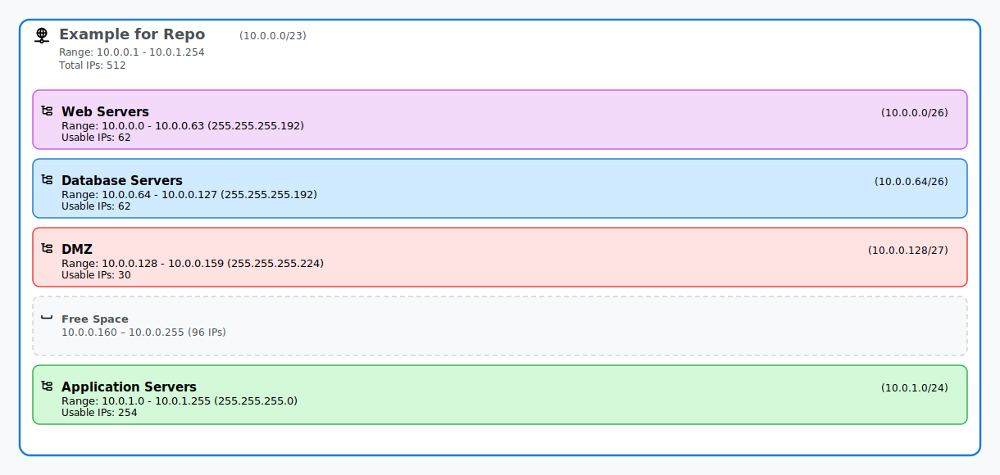

# 🚦 Russ Tools

**🌐 Live App:** [https://www.russ.tools/](https://www.russ.tools/)

Russ Tools is a suite of modern, web-based tools for network and cloud professionals. It currently includes:

- 🧮 Network Designer & Subnet Calculator
- 🏢 Microsoft Portals (GDAP)
- 🔍 Microsoft Tenant Lookup
- 🛠 Azure Resource Naming Tool
- 🔒 SSL Certificate Checker
- 🕵️ DNS Lookup Tool
- 🌐 WHOIS Lookup Tool
- 🔄 Base64 Encoder/Decoder
- 📜 Data Converter
- 🔐 JWT Decoder/Validator
- 🔒 Password Generator

## 🧰 Tools Overview

| Tool | Description |
|------|-------------|
| 🧮 **Network Designer & Subnet Calculator** | Design, calculate, and visualize IPv4 subnets, plan address allocations, and export professional diagrams. |
| 🛠 **Azure Resource Naming Tool** | Generate compliant Azure resource names following Microsoft's conventions and best practices. |
| 🔒 **SSL Certificate Checker** | Analyze and validate SSL certificates for any domain with comprehensive security analysis using SSL Labs API. |
| 🕵️ **DNS Lookup Tool** | Perform comprehensive DNS queries across multiple providers with support for all record types and caching. |
| 🌐 **WHOIS Lookup Tool** | Get detailed domain registration and IP geolocation information with modern RDAP protocol integration. |
| 🔄 **Base64 Encoder/Decoder** | Encode and decode text and files using Base64 encoding with support for standard, URL-safe, and MIME variants. Handles large files and image previews. |
| 📜 **Data Converter** | Convert data between JSON, YAML, and TOML formats. Features auto-detection, validation, formatting options (indentation, sorting), and schema validation. |
| 🔐 **JWT Decoder/Validator** | Decode, analyze, and validate JSON Web Tokens (JWT) entirely in your browser. Features signature validation, claims inspection, and security analysis. |
| 🔒 **Password Generator** | Generate cryptographically secure passwords with advanced customization options. Features entropy analysis, strength assessment, bulk generation, and detailed security feedback. |
| 🏢 **Microsoft Portals (GDAP)** | Generate tenant-specific deep links to Microsoft portals for GDAP scenarios. Discover tenant information and create direct links to Azure, Microsoft 365, Power Platform, and other Microsoft admin portals. |
| 🔍 **Microsoft Tenant Lookup** | Discover comprehensive Microsoft tenant information for any domain. Get tenant ID, organization details, DNS configuration, and authentication settings using multiple Microsoft APIs with detailed analysis. |

---

## 🔍 Microsoft Tenant Lookup

The Microsoft Tenant Lookup tool provides comprehensive tenant discovery and analysis for any Microsoft domain. It leverages multiple Microsoft APIs to deliver detailed tenant information, DNS configuration analysis, and authentication settings discovery, making it an essential tool for IT professionals, MSPs, and security analysts working with Microsoft environments.

### ✨ Why Use This Tool?
- 🔍 **Comprehensive Analysis** - Uses multiple Microsoft APIs for complete tenant discovery
- ⚡ **Instant Results** - Real-time tenant information lookup with detailed breakdown
- 🌐 **DNS Integration** - Analyzes DNS configuration including Exchange Online and Office 365 SPF
- 🛡️ **Security Focused** - Identifies tenant type, authentication methods, and federation settings
- 🔗 **GDAP Integration** - Direct links to Microsoft Portals tool for admin access
- 📊 **Professional Display** - Structured presentation of all tenant data with copy functionality

### 🔑 Key Features

- 🏢 **Tenant Discovery:**
  - Automatic tenant ID lookup from domain names or email addresses
  - Support for custom domains and onmicrosoft.com domains
  - Organization display name and federation brand detection
  - Tenant type identification (AAD, B2C, etc.)

- 📊 **Comprehensive Analysis:**
  - Default domain name and tenant category identification
  - Cloud-only vs hybrid environment detection
  - Authentication method and API source tracking
  - Real-time validation and error handling

- 🌐 **DNS Configuration Analysis:**
  - Exchange Online presence detection
  - Office 365 SPF record validation
  - MX record analysis and mail routing information
  - Complete TXT record enumeration with collapsible display

- 🔐 **User Realm Information:**
  - Namespace type identification (Managed/Federated)
  - Cloud instance and federation details
  - Authentication endpoint discovery
  - Federation brand name resolution

- 🛠️ **Professional Features:**
  - URL parameter support for direct domain lookup
  - Copy tenant ID and full JSON data to clipboard
  - Timestamp tracking for lookup history
  - Integration with Microsoft Portals (GDAP) tool
  - Mobile-responsive design with dark mode support

#### 🎯 Example Use Cases
- **MSP Client Onboarding:** Discover tenant information during client setup
- **Security Assessment:** Analyze tenant configuration and authentication methods
- **Domain Migration:** Verify tenant settings during domain transitions
- **GDAP Setup:** Gather tenant details for Granular Delegated Admin Privileges
- **Troubleshooting:** Diagnose authentication and DNS configuration issues

#### 🔒 Privacy & Security Features
- **Server-Side Processing:** All API calls handled through secure Cloudflare Worker
- **No Data Storage:** Tenant information not logged or permanently stored
- **CORS Protection:** Restricted to authorized origins only
- **Secure Connections:** All lookups use HTTPS with proper error handling

### Microsoft Tenant Lookup

Visit [https://www.russ.tools/tenant-lookup](https://www.russ.tools/tenant-lookup) and:

1. 🌐 **Enter Domain or Email:**
   - Type any domain name (e.g., contoso.com, client.onmicrosoft.com)
   - Or enter an email address (user@domain.com) - domain will be extracted automatically
   - Tool supports URL parameters: `/tenant-lookup/domain.com`

2. 🔍 **Analyze Tenant:**
   - Click "Lookup Tenant" to start comprehensive analysis
   - Real-time progress updates during API queries
   - Multiple Microsoft APIs queried for complete information

3. 📊 **Review Results:**
   - **Tenant Information:** ID, display name, type, and category
   - **DNS Analysis:** Exchange Online, SPF records, MX records, and TXT records
   - **User Realm:** Authentication type, cloud instance, and federation details
   - **Metadata:** Lookup timestamp and API method used

4. 🔗 **Access Related Tools:**
   - Direct link to Microsoft Portals (GDAP) tool with pre-filled domain
   - Copy tenant ID or complete JSON data to clipboard
   - Export functionality for documentation and analysis

5. 🛠️ **Advanced Features:**
   - Collapsible TXT record display for large DNS configurations
   - Color-coded badges for tenant types and statuses
   - Responsive design works on desktop and mobile devices

---

## 🧮 Network Designer & Subnet Calculator

### ✨ Features

- 🔢 **Subnet Calculator:**
  - Enter IPv4 address and subnet mask or CIDR (e.g., 10.0.0.0/24 or 255.255.255.0)
  - Displays network address, broadcast address, usable host range, subnet mask (dot-decimal & slash), and total hosts
  - Robust input validation with instant feedback

- 🗺️ **Network Designer & Subnet Planner:**
  - Define a parent network (supernet) and add multiple subnets of varying sizes
  - Subnet allocation logic ensures:
    - Unique, non-overlapping subnets
    - Proper boundary alignment for each subnet
    - Subnets placed at the first available valid position
  - Visualize allocated and free space within the parent network
  - Drag-and-drop subnet reordering with automatic recalculation
  - Prevents over-allocation and overlapping subnets

- 🎨 **Interactive Visualization:**
  - Modern, responsive diagram showing all subnets and free space
  - Distinct color segments for subnets, free space, network, and broadcast addresses
  - Tooltips and icons for contextual info (uses Tabler icons)
  - Animated updates and full support for dark/light mode

- 📤 **Exportable Diagrams:**
  - Export network diagrams as SVG or PNG
  - Export includes all subnets, free space, and legend
  - SVG export uses proper icons and color schemes for documentation-quality output

- 🏗️ **Terraform Export:**
  - Easily export your network/subnet design as ready-to-use Terraform code for AWS or Azure.
  - Select your preferred cloud provider (AWS or Azure) using tabs.
  - Dynamically choose a region from a dropdown list (region data loaded live from cloud provider lists).
  - Copy the generated HCL code to your clipboard with a single click.
  - Region selections are saved for convenience.
  - Powered by the `TerraformExportSection.jsx` component.
  - Supports both AWS and Azure native region lists.

- 💾 **State Persistence:**
  - All network designs and subnets are saved to localStorage and restored automatically

- 🖥️ **Modern UI:**
  - Built with [Mantine](https://mantine.dev/) for a clean, professional look
  - Fully responsive and accessible

#### 👨‍💻 Example

You can find an example of an SVG export below:



---

## 🛠 Azure Resource Naming Tool

The Azure Resource Naming Tool helps users generate compliant Azure resource names based on Microsoft's naming conventions and best practices. It provides a user-friendly interface for generating standardized names that follow organizational governance requirements and Azure's resource-specific limitations.

### ✨ Why Use This Tool?
- 🏷️ Ensures consistent naming across all Azure resources
- ❌ Reduces deployment errors due to invalid naming
- 🗂️ Improves resource management and governance
- ⚡ Accelerates resource creation by automating name generation
- 🛡️ Facilitates compliance with organizational naming policies

### 🔑 Key Features
- ⚛️ React-based, fast, and modern UI
- ✅ Supports Microsoft's recommended naming patterns and abbreviations
- ✅ Validates names in real time and provides feedback
- 🏗️ Lets users select resource type, environment, region, and other variables
- 🔤 Automatically abbreviates common terms
- 👀 Visual indicators for validation and compliance
- 🧩 Designed for extensibility and organizational policy integration

---

## 🔒 SSL Certificate Checker

The SSL Certificate Checker provides enterprise-grade SSL/TLS certificate analysis for any domain. It leverages industry-standard tools like SSL Labs API v4 to deliver comprehensive security assessments and certificate validation.

### ✨ Why Use This Tool?
- 🛡️ **Enterprise-grade analysis** using SSL Labs API v4 - the gold standard for SSL testing
- ⚡ **Instant results** with real-time certificate validation and security grading
- 🔍 **Comprehensive scanning** including vulnerability testing (Heartbleed, POODLE, BEAST, etc.)
- 🌐 **Privacy-focused** - no domain information is logged or stored
- 📊 **Industry-standard grading** using the SSL Labs A+ to F rating system
- 🔄 **Smart fallbacks** ensure reliable results even when primary services are unavailable

### 🔑 Key Features

- 🏆 **SSL Labs Integration:**
  - Powered by SSL Labs API v4 for authoritative SSL analysis
  - Comprehensive security testing and vulnerability scanning
  - Industry-standard grading system (A+ to F ratings)
  - Real-time assessment with polling for complete results

- 🛡️ **Security Analysis:**
  - Certificate validity and trust chain verification
  - TLS protocol and cipher suite analysis
  - Vulnerability testing (Heartbleed, POODLE, BEAST, etc.)
  - HSTS and security header validation
  - Browser compatibility testing

- 📋 **Certificate Information:**
  - Detailed certificate details (issuer, validity dates, serial number)
  - Subject Alternative Names (SAN) and domain matching
  - Certificate chain analysis and trust validation
  - Expiration warnings and renewal recommendations

- 🔒 **Privacy & Security:**
  - Cloudflare Worker backend for secure API access
  - No domain information logged or stored
  - Restricted to authorized origins only
  - Encrypted connections throughout the analysis process

- 📱 **Modern Interface:**
  - Clean, intuitive design with real-time results
  - Tabbed interface with comprehensive information panels
  - Visual grading system with color-coded security ratings
  - Responsive design for desktop and mobile devices

#### 🎯 Example Use Cases
- **Website Security Audits:** Validate SSL configuration for production websites
- **Certificate Monitoring:** Check certificate expiration dates and renewal needs
- **Security Compliance:** Ensure SSL configuration meets security standards
- **Troubleshooting:** Diagnose SSL/TLS connection issues and misconfigurations
- **Education:** Learn about SSL/TLS security and best practices

---

## 🕵️ DNS Lookup Tool

The DNS Lookup Tool provides comprehensive DNS query capabilities with support for multiple record types and DNS providers. It offers professional-grade DNS analysis with intelligent caching and fallback mechanisms for reliable results.

### ✨ Why Use This Tool?
- 🌐 **Multi-provider redundancy** - Query multiple DNS providers for reliable results
- ⚡ **Comprehensive record support** - All standard DNS record types in one place
- 🔒 **DNS over HTTPS** - Secure DNS queries using modern DoH protocol
- 🎯 **Smart caching** - 5-minute intelligent caching to reduce query time
- 📊 **Professional analysis** - Detailed record parsing and validation
- 🔄 **Automatic fallbacks** - Ensures results even when providers fail

### 🔑 Key Features

- 🗂️ **Complete Record Type Support:**
  - A, AAAA, MX, TXT, CNAME, NS, SOA records
  - PTR (reverse DNS), SRV, CAA records
  - Real-time validation and formatting
  - Priority and weight information for applicable records

- 🌍 **Multiple DNS Providers:**
  - Google DNS (8.8.8.8) - Primary provider
  - Cloudflare DNS (1.1.1.1) - High performance
  - OpenDNS (208.67.222.222) - Security-focused
  - Automatic fallback system for reliability

- ⚡ **Performance & Reliability:**
  - DNS over HTTPS (DoH) implementation
  - 5-minute intelligent caching system
  - Query history tracking and management
  - Export functionality for documentation

- 📱 **Modern Interface:**
  - Clean tabbed interface with organized results
  - Real-time query status and provider information
  - Copy-to-clipboard functionality
  - URL parameter support for direct queries

#### 🎯 Example Use Cases
- **DNS Troubleshooting:** Diagnose DNS resolution issues across providers
- **Domain Migration:** Verify DNS propagation during domain transfers
- **Security Analysis:** Check for suspicious DNS records or misconfigurations
- **Performance Testing:** Compare DNS response times across providers
- **Documentation:** Export DNS configurations for network documentation

### DNS Lookup Tool

Visit [https://www.russ.tools/dns-lookup](https://www.russ.tools/dns-lookup) and:

1. 🌐 **Enter Domain or IP:**
   - Type any domain name (e.g., example.com, www.github.com)
   - Or enter an IP address for reverse DNS lookup (PTR records)

2. 🔍 **Select Record Type:**
   - Choose from A, AAAA, MX, TXT, CNAME, NS, SOA, PTR, SRV, or CAA
   - Each record type provides specific DNS information

3. 📊 **Review Results:**
   - **DNS Records:** Detailed record information with formatting
   - **Query Info:** Provider used, response time, and cache status
   - **History:** Previous queries with timestamps and quick repeat options

4. 🔄 **Advanced Features:**
   - Export results as JSON for documentation
   - Copy individual records to clipboard
   - Automatic fallback if primary DNS provider fails

---

## 🌐 WHOIS Lookup Tool

The WHOIS Lookup Tool provides enterprise-grade domain registration and IP geolocation information using modern RDAP (Registration Data Access Protocol) and industry-leading IP databases. It delivers comprehensive analysis for both domains and IP addresses with intelligent caching and calendar integration.

### ✨ Why Use This Tool?
- 🔄 **Modern RDAP Protocol** - Uses official IANA registry data instead of legacy WHOIS
- 🌍 **Dual Functionality** - Both domain registration and IP geolocation in one tool
- 🎯 **Smart Auto-completion** - TLD suggestions from official IANA database
- 📅 **Calendar Integration** - Download domain expiration reminders as iCal files
- 🎨 **Beautiful JSON Display** - Syntax-highlighted raw data with Prism
- 🔒 **Privacy-Focused** - Cloudflare Worker backend with secure API access

### 🔑 Key Features

- 🏢 **Domain Registration Analysis:**
  - Complete registration information (created, expires, updated dates)
  - Registrar details and contact information
  - Domain status codes and validation
  - Nameserver configuration and DNS setup
  - Real-time RDAP queries to authoritative registries

- 🌍 **IP Geolocation Intelligence:**
  - Precise location data (city, region, country with flags)
  - Network information (ISP, ASN, organization)
  - Security analysis (proxy/VPN detection, hosting provider identification)
  - Reverse DNS and hostname resolution

- 🎯 **Smart Input & Auto-completion:**
  - Auto-complete TLD suggestions from IANA database (600+ TLDs)
  - Automatic IP vs domain detection
  - Input validation and cleaning
  - URL parameter support for direct queries

- 📊 **Advanced Features:**
  - 30-minute intelligent caching system
  - Lookup history tracking and management
  - iCal download for domain expiration reminders
  - JSON export with syntax highlighting
  - Multiple data source tracking and validation

- 🎨 **Professional Interface:**
  - Tabbed interface (Results, Data Sources, Raw Data)
  - Syntax-highlighted JSON using Prism
  - Modern card-based layout with icons
  - Dark/light theme support

#### 🎯 Example Use Cases
- **Domain Research:** Investigate domain ownership and registration details
- **IP Investigation:** Analyze IP addresses for geolocation and network information
- **Security Analysis:** Identify suspicious domains or IP addresses
- **Domain Management:** Track domain expiration dates with calendar reminders
- **Network Documentation:** Export WHOIS data for network inventories

### WHOIS Lookup Tool

Visit [https://www.russ.tools/whois-lookup](https://www.russ.tools/whois-lookup) and:

1. 🌐 **Enter Domain or IP:**
   - Type any domain name with auto-complete TLD suggestions
   - Or enter an IP address for geolocation information
   - Tool automatically detects input type

2. 🔍 **Analyze Information:**
   - Click "Lookup" to start RDAP/geolocation query
   - Real-time progress updates during data retrieval

3. 📊 **Review Results:**
   - **Domain Info:** Registration dates, registrar, nameservers, status
   - **IP Info:** Location, ISP, ASN, security analysis with country flags
   - **Data Sources:** See which registries and APIs provided the data
   - **Raw Data:** Syntax-highlighted JSON for technical analysis

4. 📅 **Additional Features:**
   - Download domain expiration reminders as iCal files
   - Export complete results as JSON
   - View lookup history with repeat functionality

---

## 🔐 JWT Decoder/Validator

The JWT Decoder/Validator provides comprehensive JWT (JSON Web Token) analysis and validation entirely in your browser. It offers professional-grade token inspection with signature validation capabilities while maintaining complete privacy by never sending tokens to external services.

### ✨ Why Use This Tool?
- 🔒 **Complete Privacy** - All processing happens locally in your browser
- 🔍 **Comprehensive Analysis** - Decode, analyze, and validate JWT tokens
- ⚡ **Real-time Processing** - Instant token analysis as you type
- 🛡️ **Security Focused** - Signature validation for RSA/ECDSA algorithms
- 📊 **Professional Display** - Structured presentation of all token data
- 🎯 **Developer Friendly** - Perfect for API debugging and authentication troubleshooting

### 🔑 Key Features

- 🔍 **Token Decoding & Validation:**
  - Automatic JWT format validation (3-part structure)
  - Header decoding with algorithm and type detection
  - Payload decoding with all claims displayed
  - Signature extraction and display
  - Real-time format validation with error reporting

- 📊 **Advanced Token Analysis:**
  - Expiration status checking with visual indicators
  - Timestamp analysis (issued at, expires at, not before)
  - Algorithm identification and security assessment
  - Token validity status with color-coded alerts
  - Custom claims detection and categorization

- 🔐 **Signature Validation:**
  - RSA algorithm support (RS256, RS384, RS512)
  - ECDSA algorithm support (ES256, ES384, ES512)
  - RSA-PSS algorithm support (PS256, PS384, PS512)
  - PEM and JWK public key format support
  - Real-time validation with detailed error reporting

- 📋 **Claims Inspector:**
  - Standard JWT claims (iss, sub, aud, exp, nbf, iat, jti)
  - Custom application-specific claims identification
  - Structured data presentation with syntax highlighting
  - Role and permission analysis for authorization tokens

- 🛠️ **Developer Tools:**
  - URL parameter support for direct token links
  - Clipboard integration for quick token input
  - Copy individual token parts (header, payload, signature)
  - Example tokens for testing and learning
  - Mobile-responsive design for on-the-go debugging

#### 🎯 Example Use Cases
- **API Development:** Debug JWT tokens during API integration
- **Authentication Troubleshooting:** Analyze token claims and expiration issues
- **Security Auditing:** Examine token structure and signing algorithms
- **Integration Testing:** Validate token format and content before deployment
- **Learning & Education:** Understand JWT structure and security concepts

#### 🔒 Security & Privacy Features
- **Client-Side Processing:** Tokens never leave your browser
- **No External API Calls:** Complete offline functionality
- **Open Source Transparency:** Full visibility into processing logic
- **Secure Validation:** Industry-standard cryptographic libraries (jose)

#### ⚠️ Browser Limitations
Due to browser security constraints:
- **HMAC Validation Not Supported:** HS256/HS384/HS512 require server-side validation
- **Public Key Algorithms Only:** RSA and ECDSA validation supported
- **Symmetric Key Limitation:** HMAC secrets cannot be safely handled in browsers

---

## 🔒 Password Generator

The Password Generator creates cryptographically secure passwords with advanced customization options and comprehensive security analysis. It provides enterprise-grade password generation with detailed entropy calculations, strength assessments, and security recommendations to help users create truly secure passwords.

### ✨ Why Use This Tool?
- 🛡️ **Cryptographically Secure** - Uses browser's secure random number generation
- 📊 **Advanced Analytics** - Detailed entropy analysis and strength assessment
- ⚡ **Bulk Generation** - Generate multiple passwords simultaneously
- 🎯 **Highly Customizable** - Extensive options for character sets and exclusions
- 🔍 **Security Feedback** - Real-time recommendations and vulnerability analysis
- 💾 **Export Capabilities** - Download passwords securely for offline storage

### 🔑 Key Features

- 🔐 **Advanced Password Generation:**
  - Configurable length (1-128 characters)
  - Multiple character sets (uppercase, lowercase, numbers, symbols)
  - Exclude similar characters (i, l, 1, L, o, 0, O) for readability
  - Exclude ambiguous characters for better compatibility
  - Guaranteed inclusion of selected character types

- 📈 **Comprehensive Security Analysis:**
  - Real-time entropy calculation (bits of randomness)
  - Detailed strength assessment (Very Weak to Excellent)
  - Time-to-crack estimates using modern attack scenarios
  - Character set size analysis and recommendations
  - Visual strength indicators with color coding

- 🎯 **Smart Security Feedback:**
  - Real-time recommendations for improving password strength
  - Warnings about weak configurations
  - Best practice suggestions for length and complexity
  - Character variety analysis and optimization tips

- 📊 **Bulk Password Generation:**
  - Generate 1-100 passwords at once
  - Timestamp tracking for generation history
  - Individual copy-to-clipboard for each password
  - Bulk download as secure text file with metadata

- 💾 **Export & Management:**
  - Download passwords as formatted text file
  - Includes generation metadata and security notices
  - Clear all passwords with confirmation
  - Copy individual passwords to clipboard

- 🔍 **Educational Features:**
  - Detailed explanation of entropy and password strength
  - Visual representation of possible combinations
  - Time-to-crack scenarios with realistic attack models
  - Security best practices and recommendations

#### 🎯 Example Use Cases
- **Enterprise Security:** Generate secure passwords for business accounts
- **Personal Security:** Create strong passwords for personal use
- **Bulk Account Creation:** Generate multiple passwords for system administration
- **Security Training:** Understand password strength and entropy concepts
- **Compliance Requirements:** Meet organizational password complexity standards

#### 🔒 Security Features
- **Client-Side Generation:** All passwords generated locally in your browser
- **Secure Random Numbers:** Uses cryptographically secure browser APIs
- **No Network Transmission:** Passwords never leave your device
- **Memory Safety:** Passwords cleared from memory when possible
- **Export Security:** Downloaded files include security warnings and best practices

#### 📊 Advanced Analytics
The tool provides detailed security metrics including:
- **Entropy Calculation:** Precise bits of randomness measurement
- **Combination Analysis:** Total possible password combinations
- **Attack Modeling:** Time estimates based on modern GPU capabilities
- **Strength Grading:** Industry-standard security level assessment
- **Character Analysis:** Detailed breakdown of character set effectiveness

---

## 🏢 Microsoft Portals (GDAP)

The Microsoft Portals (GDAP) tool is designed for Managed Service Providers (MSPs) and partners who need to quickly access Microsoft admin portals for their clients' tenants. It automatically discovers tenant information from domain names and generates direct, tenant-specific links to over 90 Microsoft portals including Azure, Microsoft 365, Power Platform, and specialized admin centers.

### ✨ Why Use This Tool?
- 🚀 **GDAP Optimized** - Perfect for Granular Delegated Admin Privileges scenarios
- ⚡ **Instant Access** - Generate tenant-specific portal links in seconds
- 🎯 **Comprehensive Coverage** - 90+ Microsoft portals across all service areas
- 🏷️ **Smart Tagging** - 240+ tags for precise portal discovery and filtering
- 💾 **Recent Domains** - Quick access to frequently used client tenants
- 🔍 **Advanced Search** - Search by portal name, description, or tags

### 🔑 Key Features

- 🌐 **Tenant Discovery:**
  - Automatic tenant ID lookup from domain names
  - Support for custom domains and onmicrosoft.com domains
  - Intelligent caching to reduce lookup times
  - Recent domain history with quick access

- 🏢 **Comprehensive Portal Coverage:**
  - **Azure Portals:** Azure Portal, Cost Management, Security Center, etc.
  - **Microsoft 365:** Admin Center, Exchange, SharePoint, Teams, etc.
  - **Power Platform:** Power Apps, Power BI, Power Automate admin centers
  - **Security & Compliance:** Defender, Purview, Compliance Center
  - **Developer Tools:** Azure DevOps, App Registrations, API Management

- 🏷️ **Advanced Tagging & Filtering:**
  - 240+ descriptive tags for precise portal discovery
  - Hash-based consistent color coding for visual organization
  - Clickable tags for instant filtering
  - Category-based organization (Azure, M365, Security, etc.)

- 🔍 **Smart Search & Discovery:**
  - Real-time search across portal names, descriptions, and tags
  - Tag-based filtering with visual feedback
  - Browse all tags modal with alphabetical organization
  - Search within tags for quick discovery

- 💾 **User Experience Features:**
  - Recent domains with removal capability
  - Favorites system for frequently used portals
  - Copy portal URLs to clipboard
  - Direct portal opening in new tabs
  - Responsive design for desktop and mobile

#### 🎯 Example Use Cases
- **MSP Client Management:** Quickly access client tenant admin portals
- **Multi-Tenant Administration:** Switch between different customer tenants
- **Portal Discovery:** Find specific Microsoft admin portals by functionality
- **GDAP Workflows:** Streamline delegated admin access patterns
- **Training & Documentation:** Discover available Microsoft admin interfaces

#### 🔒 Privacy & Security Features
- **Client-Side Processing:** Tenant lookups use secure APIs
- **No Data Storage:** Domain information cached locally only
- **Secure Connections:** All API calls use HTTPS
- **Privacy-Focused:** No tracking or logging of tenant information

### Microsoft Portals (GDAP)

Visit [https://www.russ.tools/microsoft-portals](https://www.russ.tools/microsoft-portals) and:

1. 🌐 **Enter Domain:**
   - Type any domain name (e.g., contoso.com, client.onmicrosoft.com)
   - The tool automatically discovers tenant information
   - Recent domains appear for quick access

2. 🔍 **Discover Portals:**
   - Browse 90+ Microsoft portals organized by category
   - Use the search box to find specific portals by name or description
   - Click on tags to filter portals by functionality

3. 🏷️ **Filter by Tags:**
   - Click any tag to filter portals instantly
   - Use the "Browse All Tags" button to explore 240+ available tags
   - Search within tags for quick discovery

4. ⭐ **Manage Favorites:**
   - Star frequently used portals for quick access
   - Favorites are saved locally and persist across sessions

5. 🚀 **Access Portals:**
   - Copy portal URLs to clipboard for sharing
   - Open portals directly in new tabs with tenant context
   - All links are tenant-specific and ready to use

6. 💾 **Recent Domains:**
   - Quick access to recently looked up domains
   - Remove domains from history with the X button
   - Domains are cached locally for faster subsequent lookups

### JWT Decoder/Validator

Visit [https://www.russ.tools/jwt](https://www.russ.tools/jwt) and:

1. 🔐 **Input JWT Token:**
   - Paste your JWT token into the input field
   - Use the clipboard button for quick pasting
   - Load example tokens for testing and learning

2. 🔍 **Analyze Token:**
   - **Decoded Data:** View header, payload, and signature in separate tabs
   - **Token Analysis:** See expiration status, algorithm info, and validity indicators
   - **Claims Inspector:** Examine standard and custom claims with structured display

3. ✅ **Validate Signature (Optional):**
   - Enable signature validation toggle
   - Paste your public key (PEM or JWK format)
   - View validation results with detailed error reporting

4. 📊 **Review Results:**
   - **Security Status:** Visual indicators for token validity and expiration
   - **Algorithm Info:** Signing method and security assessment
   - **Claims Data:** Complete breakdown of all token claims
   - **Timestamps:** Human-readable date/time information

5. 🛠️ **Developer Features:**
   - Copy individual token parts for debugging
   - Share tokens via URL parameters
   - Export analysis results for documentation

## 🚀 Usage

### Network Designer & Subnet Calculator

Visit [https://www.russ.tools/network-designer](https://www.russ.tools/network-designer) and:

1. 🏁 **Set a Parent Network:**
   - 📝 Enter a network address (e.g., 10.0.0.0) and CIDR (e.g., /16)
2. **Add Subnets:**
   - Specify subnet name and size (CIDR)
   - Subnets are placed automatically with no overlaps
3. **Visualize:**
   - See a live diagram of all subnets and free space
   - Hover for details, drag to reorder, or remove subnets
4. **Export:**
   - Download your diagram as SVG or PNG for documentation
5. **Persistence:**
   - All changes are saved locally and restored on reload

### Azure Resource Naming Tool

Visit [https://www.russ.tools/azure-naming/](https://www.russ.tools/azure-naming/) and:

1. 🏷️ **Enter Workload/Application Name:**  
   - e.g., payments, webapp, database
2. 🏢 **Select Resource Type:**  
   - Choose one or more Azure resource types from the dropdown
3. 🌎 **Select Environment and Region:**  
   - Pick the environment (e.g., dev, test, prod) and Azure region
4. 🔢 **(Optional) Customize:**  
   - Instance number (e.g., 001)  
   - Add a custom prefix or suffix  
   - Add random characters for uniqueness if needed
5. ⚡ **Generate Name:**  
   - Click **Generate Name** to create a compliant resource name
6. 💾 **Save or Load Names:**  
   - Save generated names for reuse, or load previously saved names from the list

### SSL Certificate Checker

Visit [https://www.russ.tools/ssl-checker](https://www.russ.tools/ssl-checker) and:

1. 🌐 **Enter Domain:**
   - Type any domain name (e.g., example.com, www.github.com)
   - The tool automatically handles protocol removal and domain cleaning

2. 🔍 **Analyze Certificate:**
   - Click "Check SSL Certificate" to start the analysis
   - Real-time progress updates during SSL Labs assessment

3. 📊 **Review Results:**
   - **Certificate Details:** Validity dates, issuer information, and trust status
   - **Security Grade:** Industry-standard A+ to F rating with explanation
   - **Validation Info:** Comprehensive security analysis and recommendations

4. 📚 **Learn More:**
   - Switch to the "About SSL" tab for educational content
   - Understand SSL/TLS concepts, grading system, and security best practices

### DNS Lookup Tool

Visit [https://www.russ.tools/dns-lookup](https://www.russ.tools/dns-lookup) and:

1. 🌐 **Enter Domain or IP:**
   - Type any domain name (e.g., example.com, www.github.com)
   - Or enter an IP address for reverse DNS lookup (PTR records)

2. 🔍 **Select Record Type:**
   - Choose from A, AAAA, MX, TXT, CNAME, NS, SOA, PTR, SRV, or CAA
   - Each record type provides specific DNS information

3. 📊 **Review Results:**
   - **DNS Records:** Detailed record information with formatting
   - **Query Info:** Provider used, response time, and cache status
   - **History:** Previous queries with timestamps and quick repeat options

4. 🔄 **Advanced Features:**
   - Export results as JSON for documentation
   - Copy individual records to clipboard
   - Automatic fallback if primary DNS provider fails

### WHOIS Lookup Tool

Visit [https://www.russ.tools/whois-lookup](https://www.russ.tools/whois-lookup) and:

1. 🌐 **Enter Domain or IP:**
   - Type any domain name with auto-complete TLD suggestions
   - Or enter an IP address for geolocation information
   - Tool automatically detects input type

2. 🔍 **Analyze Information:**
   - Click "Lookup" to start RDAP/geolocation query
   - Real-time progress updates during data retrieval

3. 📊 **Review Results:**
   - **Domain Info:** Registration dates, registrar, nameservers, status
   - **IP Info:** Location, ISP, ASN, security analysis with country flags
   - **Data Sources:** See which registries and APIs provided the data
   - **Raw Data:** Syntax-highlighted JSON for technical analysis

4. 📅 **Additional Features:**
   - Download domain expiration reminders as iCal files
   - Export complete results as JSON
   - View lookup history with repeat functionality

### Base64 Encoder/Decoder

Visit [https://www.russ.tools/base64](https://www.russ.tools/base64) and:

1. Toggle **Encode** or **Decode** mode.
2. **For Encoding:**
   - Paste text into the input area OR drag & drop/browse for a file (text or binary like an image).
   - Select the desired **Encoding Type** (Standard, URL-Safe, MIME).
   - Click **Encode**. The Base64 output will appear. Image previews are shown for image files.
3. **For Decoding:**
   - Paste a Base64 string into the input area OR upload a text file containing Base64 data.
   - Select the **Encoding Type** if known (usually Standard for decoding).
   - Click **Decode**. The original content will appear. Image previews are shown for decoded images (including SVGs).
4. **Manage Output:**
   - Use the copy icon to copy the output text.
   - Use the download icon to save the decoded file (e.g., as an image or text file).

### Data Converter

Visit [https://www.russ.tools/data-converter](https://www.russ.tools/data-converter) and:

1. 📝 **Input Data:**
   - Paste your data (JSON, YAML, or TOML) into the input text area.
   - OR click "Upload File" to load data from a local file.
2. 🔄 **Select Formats:**
   - Choose the **Input Format** (or leave as "Auto-detect").
   - Choose the desired **Output Format** (JSON, YAML, or TOML).
3. ⚙️ **(Optional) Configure Settings:**
   - Click the settings icon (cog) to adjust indentation, character (spaces/tabs), and key sorting preferences.
   - For JSON, enable Schema Validation if needed, select a common schema or provide a custom one.
4. ⚡ **Convert:**
   - The conversion happens automatically as you type or change settings.
   - View validation status and any errors below the input area.
5. 📋 **Use Output:**
   - Copy the converted data using the copy icon.
   - Download the output as a file using the download icon.
   - Use the "Minify" or "Reformat" buttons for quick output adjustments.

### JWT Decoder/Validator

Visit [https://www.russ.tools/jwt](https://www.russ.tools/jwt) and:

1. 🔐 **Input JWT Token:**
   - Paste your JWT token into the input field.
   - Use the clipboard button for quick pasting from your clipboard.
   - Try the example tokens to learn about JWT structure.
2. 🔍 **Analyze Token:**
   - **Decoded Data:** View the header, payload, and signature in separate tabs.
   - **Token Analysis:** Check expiration status, algorithm info, and validity indicators.
   - **Claims Inspector:** Examine all standard and custom claims with structured display.
3. ✅ **(Optional) Validate Signature:**
   - Enable the signature validation toggle.
   - Paste your public key in PEM or JWK format.
   - View detailed validation results and error reporting.
4. 📊 **Review Results:**
   - See visual indicators for token validity and expiration status.
   - Understand the signing algorithm and security assessment.
   - Copy individual token parts for debugging purposes.
5. 🛠️ **Advanced Features:**
   - Share tokens via URL parameters for collaboration.
   - Use on mobile devices with responsive design.
   - Learn about JWT security with built-in educational content.

### Microsoft Tenant Lookup

Visit [https://www.russ.tools/tenant-lookup](https://www.russ.tools/tenant-lookup) and:

1. 🌐 **Enter Domain or Email:**
   - Type any domain name (e.g., contoso.com, client.onmicrosoft.com)
   - Or enter an email address (user@domain.com) - domain will be extracted automatically
   - Tool supports URL parameters: `/tenant-lookup/domain.com` for direct access

2. 🔍 **Analyze Tenant:**
   - Click "Lookup Tenant" to start comprehensive analysis
   - Real-time progress updates during multiple Microsoft API queries
   - Automatic fallback mechanisms ensure reliable results

3. 📊 **Review Comprehensive Results:**
   - **Tenant Information:** ID, display name, type, category, and federation details
   - **DNS Analysis:** Exchange Online detection, SPF records, MX records, and complete TXT record enumeration
   - **User Realm Details:** Authentication type, cloud instance, and federation configuration
   - **Metadata:** Lookup timestamp, API methods used, and data source tracking

4. 🔗 **Access Related Tools:**
   - Direct link to Microsoft Portals (GDAP) tool with pre-filled domain for admin portal access
   - Copy tenant ID or complete JSON data to clipboard for documentation
   - Export functionality for security analysis and compliance reporting

5. 🛠️ **Advanced Features:**
   - Collapsible TXT record display for domains with extensive DNS configurations
   - Color-coded badges for quick identification of tenant types and statuses
   - Mobile-responsive design with full dark mode support
   - URL parameter support for integration with other tools and workflows

### Password Generator

Visit [https://www.russ.tools/password-generator](https://www.russ.tools/password-generator) and:

1. 🔧 **Configure Settings:**
   - Set password length (1-128 characters, recommended 16+)
   - Choose character types: uppercase, lowercase, numbers, symbols
   - Optionally exclude similar or ambiguous characters for better readability
   - Set the number of passwords to generate (1-100)

2. 📊 **Review Security Analysis:**
   - **Strength Meter:** Visual indicator from Very Weak to Excellent
   - **Entropy Analysis:** Bits of randomness and character set size
   - **Time to Crack:** Realistic estimates based on modern attack capabilities
   - **Security Feedback:** Real-time recommendations for improvement

3. 🔐 **Generate Passwords:**
   - Click "Generate Passwords" to create secure passwords
   - Each password includes timestamp and individual copy button
   - Real-time strength analysis updates as you change settings

4. 💾 **Manage Results:**
   - Copy individual passwords to clipboard with one click
   - Download all passwords as a secure text file with metadata
   - Clear all passwords when finished for security

5. 🎓 **Learn About Security:**
   - Understand entropy and password strength concepts
   - See detailed breakdown of possible combinations
   - Learn about modern password attack scenarios
   - Get recommendations for enterprise-grade security

---

## 🛠️ Technology Stack

- ⚛️ **React** (SPA framework)
- ⚡ **Vite** (build tool)
- 🎨 **Mantine** (UI framework)
- 🧮 **netmask** (IPv4 subnet calculation)
- 🖱️ **@dnd-kit/core**, **@dnd-kit/sortable** (drag-and-drop)
- 🏷️ **Tabler Icons** (SVG icons)

Key libraries used in specific tools:
- **Network Designer & Subnet Calculator:**
  - 🧮 `netmask` (IPv4 subnet calculation)
  - 🖱️ `@dnd-kit/core`, `@dnd-kit/sortable` (drag-and-drop)
- **Data Converter:**
  - 📜 `js-yaml` (YAML parsing & stringifying)
  - 📄 `@iarna/toml` (TOML parsing & stringifying)
  - ✨ `prismjs` (Syntax highlighting for JSON, YAML, TOML)
  - ✅ `ajv`, `ajv-formats` (JSON Schema validation)
- **Base64 Encoder/Decoder:**
  - Primarily uses built-in browser APIs (`btoa`, `atob`, `FileReader`) for core operations.
- **JWT Decoder/Validator:**
  - 🔐 `jwt-decode` (JWT token decoding)
  - 🔒 `jose` (JWT signature validation and cryptographic operations)
  - 🛡️ Built-in browser APIs for secure token processing

## 📦 Development

Clone the repo and run locally:

```bash
npm install
npm run dev
```

## 🤷‍♂️ Stuff

russ.tools. Built with ❤️ by Russ McKendrick and bunch of AI and other libraries.